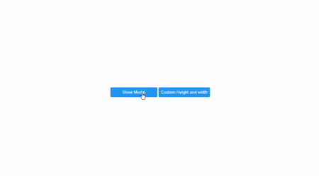

# ModalJs
The Modal Js is a plugin written in pure Javascript and CSS.
Modal Js will create a dialog box/popup window that is displayed on top of the current page.



## Usage
Add the following tags to your HTML document:

CSS
```
<link rel="stylesheet" href="https://rawcdn.githack.com/AnasOnGit/ModalJs/f3e03e23e9d7459122951c2eddb58f22ded77490/modal.css">
```
JAVASCRIPT
```
<script src="https://rawcdn.githack.com/AnasOnGit/ModalJs/f3e03e23e9d7459122951c2eddb58f22ded77490/modal.js"></script>
```

After adding these tags, create a button with the class of modal-button and add a data-modal="modal" attribute to your button.
Now create a div with the class of modal and add data-modal="modal" attribute to it, That's it.

**Add same value in data-modal attr**

Button


Div


You can create more than one modal on the same page.

**You can add any string in data-modal attribute, but you have to write the same string in modal div and in modal button**


## Demo
[Live Demo](https://anasongit.github.io/ModalJs/)

Button
```
<button class="modal-button" data-modal="modal">Login</button>
```
Div
```
<div class="modal" data-modal="modal">Login Form.</div>
```
# Add title 
You can add a title by adding _data-modal_ attribute to span or div, it should be the same as on your modal and add a class of modal-title to it.

Button
```
<button class="modal-button" data-modal="moda5">Modal with title</button>
```
Div
```
<div class="modal" data-modal="modal5">
	<span class="modal-title" data-modal="modal5">New Modal with title</span>
	<div>Login Form</div>
</div>
```

# Create Multiple Modal
You can easily create multiple modals by adding the same data-modal attribute to modal and button.

Modal 1

Button
```
<button class="modal-button" data-modal="modal1">Modal1</button>
```
Div
```
<div class="modal" data-modal="modal1">Model1</div>
``` 

Modal 2

Button
```
<button class="modal-button" data-modal="modal2">Modal2</button>
```
Div
```
<div class="modal" data-modal="modal2">Model2</div>
``` 

# Custom Height and Width
you can add custom height and width by adding data-height and data-width attr to your modal div.

Example
Modal Button
```
<button class="modal-button" data-modal="modal3">Custom Height and Width</button>
```
Modal Div
```
<div class="modal" data-modal="modal3"  data-height="500px" data-width="400px">
	custom height and width
</div>
```

## Template
```
<!DOCTYPE html>
<html lang="en">
<head>
	<meta charset="UTF-8">
	<title>Modal Test</title>
	<link rel="stylesheet" href="https://rawcdn.githack.com/AnasOnGit/ModalJs/f3e03e23e9d7459122951c2eddb58f22ded77490/modal.css"

</head>
<body>
	<!-- Modal button with class of modal-button and custom html attr of data-modal attr which sould same as on your modal -->
	<button class="modal-button" data-modal="modal1">Show Modal</button>
	<button class="modal-button" data-modal="modal2">Custom Height and width</button>

	<!-- Modal with class of modal and custom html attr of data-modal  which sould same as on your modal button -->
	<div class="modal" data-modal="modal1">Press "ESC" or click twice on the page to the close modal.</div>

	<!-- you can also define custom heigh and width from data-height and data-width attr -->
	<div class="modal" data-modal="modal2"  data-height="500px" data-width="400px">
		custom height and width
	</div>
	<script src="https://rawcdn.githack.com/AnasOnGit/ModalJs/f3e03e23e9d7459122951c2eddb58f22ded77490/modal.js"></script>
</body>
</html>	
```

# Features
1. Press Esc to close
2. Double click on the background to close
3. Close button


CDN created by [GitHack](https://raw.githack.com/)

[Blog](https://programmingplugs.blogspot.com/2020/02/create-modal-from-html-javascript-and.html)
