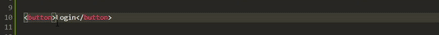
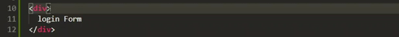

# ModalJs
create modal with pure Javascript and css.

## Usage
Add following tags to your html document:

CSS
```
<link rel="stylesheet" href="https://rawcdn.githack.com/AnasOnGit/ModalJs/f3e03e23e9d7459122951c2eddb58f22ded77490/modal.css">
```
JAVASCRIPT
```
<script src="https://rawcdn.githack.com/AnasOnGit/ModalJs/f3e03e23e9d7459122951c2eddb58f22ded77490/modal.js"></script>
```

After adding these tags, create a button with the class of modal-button and add a data-modal="modal" attribute to your button.
Now create a div with the class of modal and add data-modal="modal" attribute to it, That's it.

**Add same value in data-modal attr**

Button



Div



You can create more than one modal on same page.

**You can add any string in data-modal attribute, but you have to write same string in modal div and in modal button**


## Example
[Live Example](https://anasongit.github.io/ModalJs/)

Button
```
<button class="modal-button" data-modal="modal">Login</button>
```
Div
```
<div class="modal" data-modal="modal">Login Form.</div>
```

## Template
```
<!DOCTYPE html>
<html lang="en">
<head>
	<meta charset="UTF-8">
	<title>Modal Test</title>
	<link rel="stylesheet" href="https://rawcdn.githack.com/AnasOnGit/ModalJs/f3e03e23e9d7459122951c2eddb58f22ded77490/modal.css"

</head>
<body>
	<!-- Modal button with class of modal-button and custom html attr of data-modal attr which sould same as on your modal -->
	<button class="modal-button" data-modal="modal1">Show Modal</button>
	<button class="modal-button" data-modal="modal2">Custom Height and width</button>

	<!-- Modal with class of modal and custom html attr of data-modal  which sould same as on your modal button -->
	<div class="modal" data-modal="modal1">Press "ESC" or click twice on the page to the close modal.</div>

	<!-- you can also define custom heigh and width from data-height and data-width attr -->
	<div class="modal" data-modal="modal2"  data-height="500px" data-width="400px">
		custom height and width
	</div>
	<script src="https://rawcdn.githack.com/AnasOnGit/ModalJs/f3e03e23e9d7459122951c2eddb58f22ded77490/modal.js"></script>
</body>
</html>	
```

# Features
1. Press Esc to ESC
2. Double click on background to close
3. Close button

cdn created by:[GitHack](https://raw.githack.com/)
